```{r setup, include=FALSE}
knitr::opts_chunk$set(echo = FALSE)
```

# Question 1

## Part A

```{r fig.cap="Part A: Table 10", out.width = '100%'}
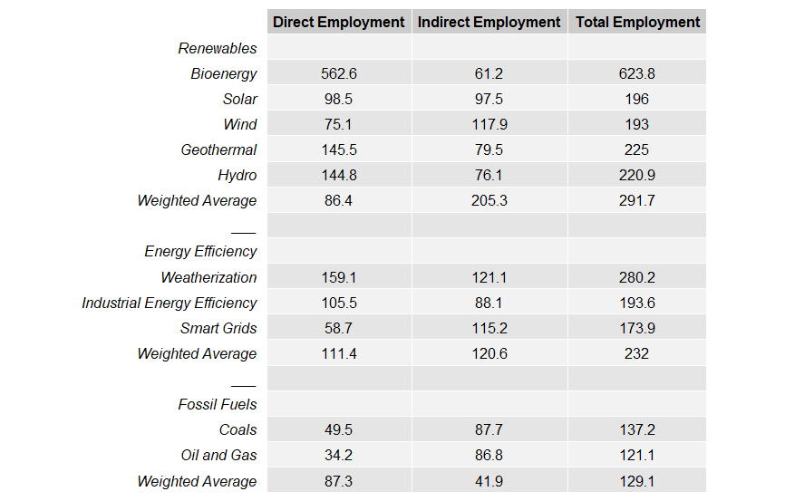
```

```{r fig.cap="Part A: Table 11", out.width = '100%'}
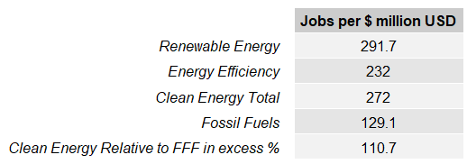
```

In “An Egalitarian Green Growth Program for India” (Pollin and Chakraborty, 2015), Pollin and Chakraborty use input/output tables to generate figures for potential job creation under a “green growth” regime in India. Using data from the World Input-Output Database, an employment matrix is generated which maps the number of jobs created per million dollars spent for each industry specified in the IO table. Based on an approximate array of aggregated weighting for the inputs of different energy sectors (e.g. wind, solar, hydro, etc.), employment figures are generated for these energy sectors. Finally, the energy sectors are further aggregated into renewables and fossil fuels, and the employment figures are compared. In sum, based on the approximate aggregate weights, investing in green energy and infrastructure generates more than twice the amount of jobs per million dollars invested than investing in fossil fuels (+110.7%). 

## Part B

For part B, I assigned different weights for each sub-sectoral level, as well as for the macro-sectoral level. The assigned weights were generally arbitrary guesses at which industries would be directly employed by each energy source. I attempted to make these assignments without bias from the weights assigned by Pollin and Chakraborty. One main difference was in my assignment of weights to the transportation sector, as I predict the transportation of materials will be a solid component of sectors such as bioenergy, solar, and wind. I also did not include direct employment categories for education, as I view job growth in the education sectors to be indirectly affected through the direct industries employed. Finally, for the macro-level sectors, I predicted what I think would be more reasonable and environmentally conscious weights for the field of renewable energy (for example, the use of bioenergy is controversial and environmentally destructive, thus I assigned it a lower weight than others). For the use of fossil fuels, I assigned a higher weight to oil and gas, as these are generally used more than coal around the world. The weights and resulting replicated tables are below.

```{r fig.cap="Part B: Alternative Weights"}
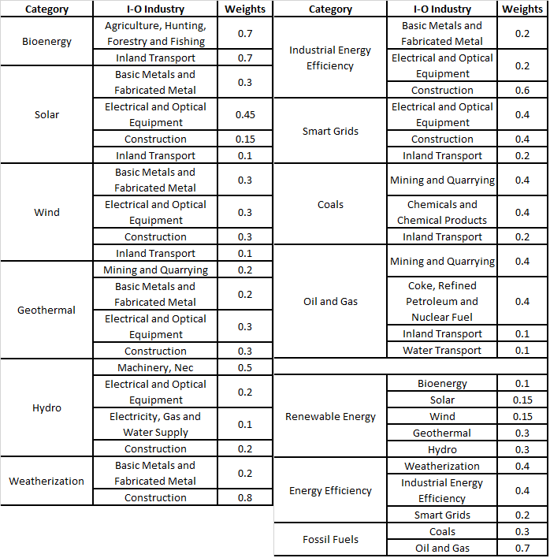
```

```{r fig.cap="Part B: Table 10", out.width = '100%'}
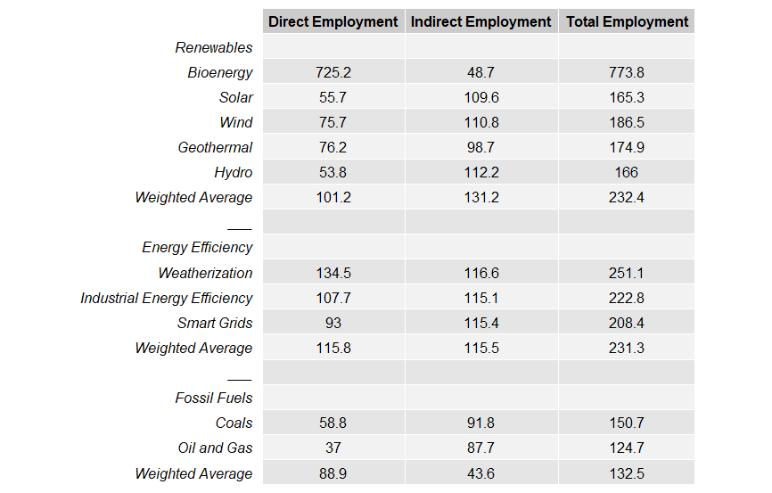
```

```{r fig.cap="Part B: Table 11", out.width = '100%'}
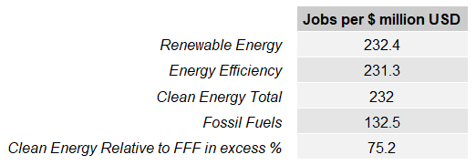
```

The use of my alternative weighting scheme changed the resulting outcomes. While investment in clean energy is still predicted to contribute to a higher level of job growth than investment in fossil fuels, the level of excess employment decreased from +111% to +75%. This is mainly due to the fact that my weighting scheme assigned less weight for renewable energy sectors to labor-intensive industries than Pollin and Chakraborty’s weights, and my weighting scheme assigned slightly more labor-intensive industries (such as inland transport) for the fossil fuels sectors. In addition, since bioenergy is the field with the most employment per dollar invested, and since I assigned less weight to bioenergy in the renewable energy macro-sector, the employment level for renewable energies decreased. 

## Part C

I was surprised to find that the weights assigned in Pollin and Chakraborty’s paper were not necessarily based on expert-guided information, but intuition, and that alternative weighting schemes have the potential to change the results somewhat substantially. My weights did not different entirely from the weights assigned by Pollin and Chakraborty, yet the degree to which clean energy investment provides more employment than fossil fuel investment weakened substantially. It is entirely plausible to create weighting schemes where fossil fuel investment contributes to more employment than clean energy. After conducting these exercises, I am convinced that the method Pollin and Chakraborty used can be extremely useful and incisive, but that the results are not entirely robust. The use of input-output matrices to predict sectoral employment should be coupled with accurate predictions for the division of investment into specific industries based on a substantial survey of current investment. If the assigned weights were based on empirically observed investment practices, then I think the results could be bolstered to the point of being considered robust.

# Question 2

## Part 1

```{r fig.cap="Table 2 of Reinhart and Rogoff", out.width = '100%'}
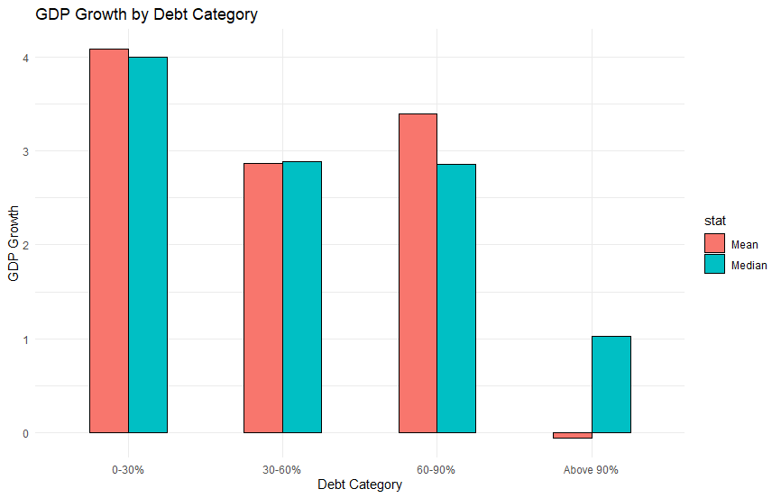
```

Figure 2 of Reinhart and Rogoff was replicated from R code provided by Herndon et al. The paper uses a new historical data set on public debt to explore the relationship between a nation’s GDP growth and its debt-to-GDP ratio. The code imports data on GDP levels and public debt over time for various countries, computes GDP growth rates and debt-to-GDP ratios, categorizes debt ratios into levels (0-30%, 30-60%, 60-90%, and above 90%), and determines average GDP growth across countries for the different debt ratio categories. However, several mistakes were made in RR’s calculations, including a transcription typo and a spreadsheet error which excluded several countries (in alphabetical order) from their calculations. Furthermore, instead of counting each individual observation (i.e. a country’s data in an individual year) once, each country’s data was aggregated into an average GDP growth rate within each debt category, and those aggregates were further averaged to get the final results. Herndon et al.’s R code includes all of these mistakes (both typos and methodological flaws) in order to replicate RR’s results. To replicate the figure, I combined mean and median data generated by their code and plotted the results.

## Part 2

In order to show the prevalence of the four public-debt categories and the GDP growth rate for the sample of countries over time in a succinct way, I aggregated growth rates into different growth rate categories and aggregated the data into seven time periods. Below displays side-by-side tables, with debt-to-GDP ratios on the left and growth rates on the right, first listed by country and then listed by time period.

```{r fig.show="hold", fig.cap="Number of Years in Debt-to-GDP Ratio Category and GDP Growth Rate Category by Country", out.height='50%'}
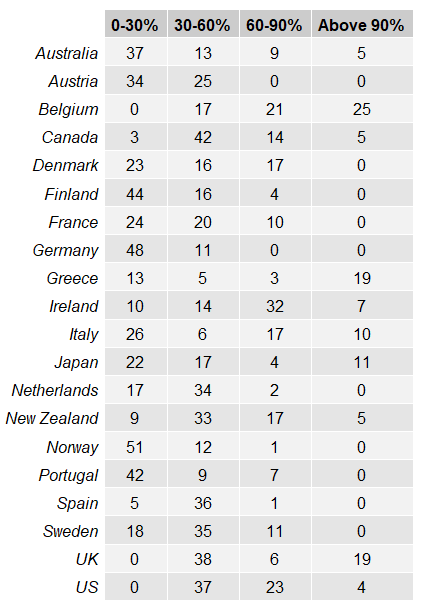
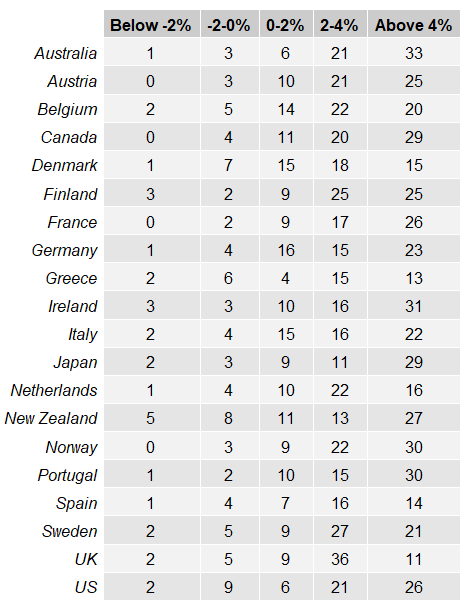
```

```{r fig.show="hold", fig.cap="Number of Observations in Debt-to-GDP Ratio Category and GDP Growth Rate Category by Year Group", out.width=c('225px','250px'), out.height=c('250px','250px')}
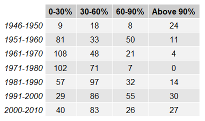
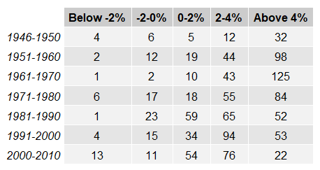
```

What becomes evident when looking at this data is that the number of years when countries experienced high debt-to-GDP ratios is concentrated in a few different countries, and each of those countries did not experience low growth rates for the same number of years as they experienced high debt ratios. For example, Belgium experienced debt ratios above 60% for 46 years — the majority of its observations — yet only experienced GDP growth below 2% for 21 years (which don’t necessarily overlap with high debt ratios). This evinces the bias that is generated when all of a country’s observations are first aggregated before taking average debt ratios and growth rates, as opposed to counting each individual observation with equal weight. 

In addition, many of the high debt ratio observations are concentrated in certain time periods which do not overlap with high counts of low GDP growth. The post-WWII period stands out in particular. Herndon et al. point out that, without justification, RR excluded several observations of high debt ratios combined with high GDP growth (e.g. New Zealand and Canada) while retaining observations in the same period for the US which experienced low GDP growth with high debt ratios. 

## Part 3

```{r fig.cap="Figure 1 of Herndon et al", out.width = '100%'}
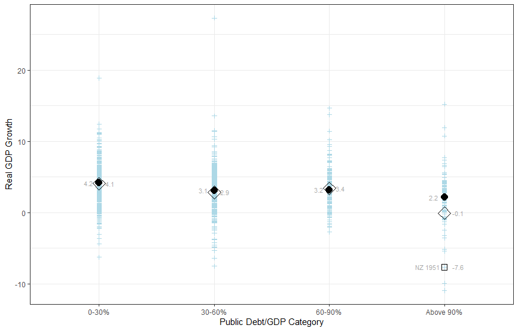
```

```{r fig.cap="Figure 2 of Herndon et al", out.width = '100%'}
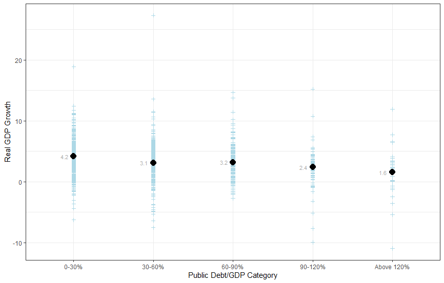
```

```{r fig.cap="Figure 4 of Herndon et al", out.width = '100%'}
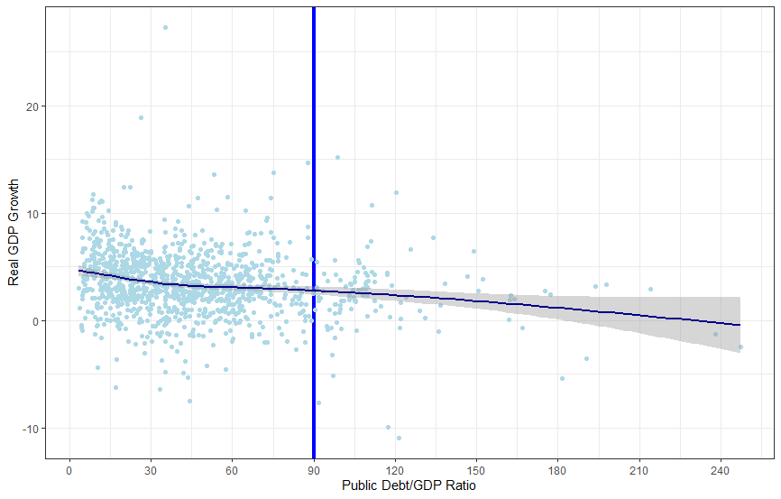
```

Figures 1, 2, and 4 of Herndon et al. were replicated using code provided by Herdan et al. In figure 1, all individual observations of GDP growth are plotted by debt ratio category. Immediately evident is that: (1) the corrected method and data sample offer starkly different results than RR, (2) there are significantly less observations for the highest debt ratio category, (3) the lack of observations in the high debt category make it more prone to biases due to a few outliers, which also exist for other debt categories. Figure 1 paints a visible picture that reveals the methodological flaws in RR’s method.

Figure 2 repeats the plot of figure 1, but adds another debt ratio category: above 120%. By excluding debt ratios above 120% in the 90-120% category, the mean for that category goes up to 2.4%, which is not a significant decline from the 3.2% growth rate in the 60-90% category. Furthermore, figures 1 and 2 display the wide variation across observations, calling into question the robustness of RR’s conclusions.

Figure 4 presents a scatter plot of debt ratios to GDP growth. It more definitively reveals the wide variation across observations of all debt ratio categories and makes obvious the insufficient clarity to make the conclusions of RR. It also reveals the paucity of observations at higher debt ratio categories. Finally, the trend line reveals that the relation between the debt-to-GDP ratio and GDP growth most substantially falls at lower debt ratios than it does at higher ratios. I present the figures in slightly different colors because I find it more pretty.

## Part 4

Below, I present superimposed scatterplots of GDP growth rate and debt-to-GDP ratios over time for several countries used in RR. For each, the green line represents debt-to-GDP ratios, and the blue line represents GDP growth rates.

```{r fig.cap="US: GDP Growth Rate (Blue) and Debt-to-GDP Ratio (Green) Over Time", out.height = '40%'}
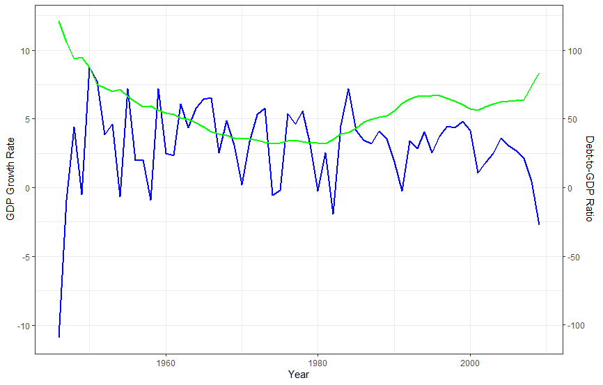
```

```{r fig.cap="UK: GDP Growth Rate (Blue) and Debt-to-GDP Ratio (Green) Over Time", out.height = '40%'}
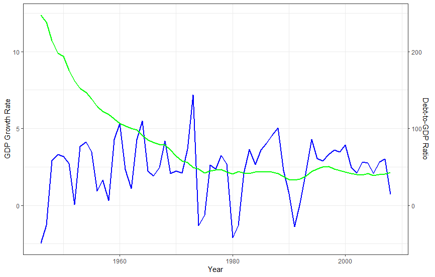
```

```{r fig.cap="Greece: GDP Growth Rate (Blue) and Debt-to-GDP Ratio (Green) Over Time", out.height = '40%'}
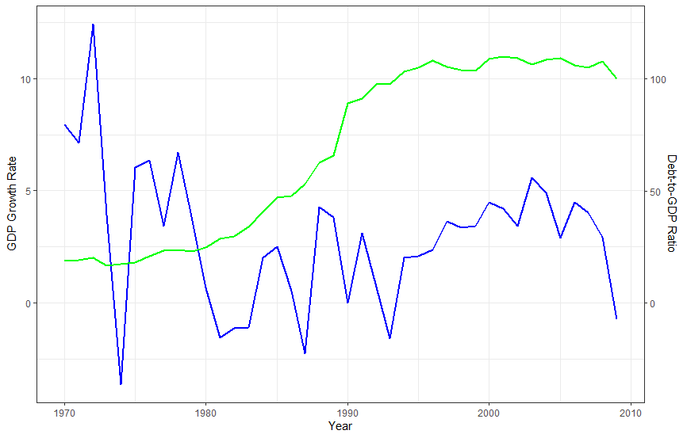
```

```{r fig.cap="Belgium: GDP Growth Rate (Blue) and Debt-to-GDP Ratio (Green) Over Time", out.height = '40%'}
knitr::include_graphics("Question2_Part4-Belgium.png")
```

```{r fig.cap="Italy: GDP Growth Rate (Blue) and Debt-to-GDP Ratio (Green) Over Time", out.height = '40%'}
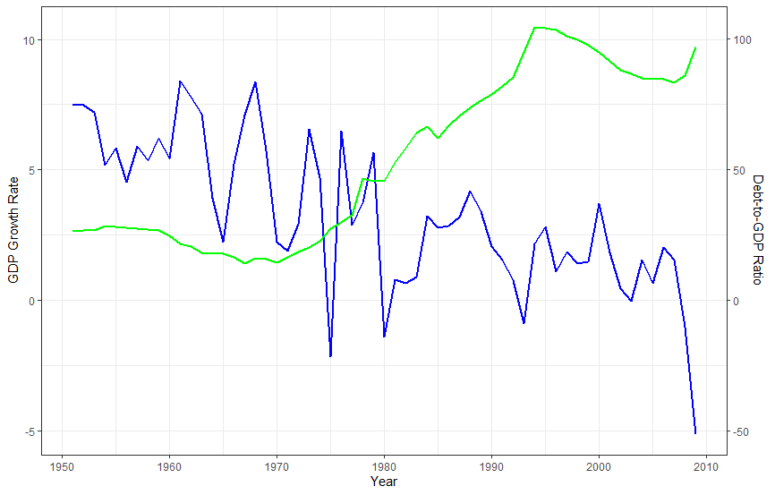
```

The plots help to visualize how both GDP growth and debt ratios evolve over time within specific countries. According to RR’s conclusion that high debt ratios trigger a falloff in growth rates, we should expect to see growth rates fall after debt ratios increase, with a special falloff after reaching debt ratios of 90%. However, what is striking about these plots is the obvious lack of a clear causal connection between debt ratios and growth rates.

According to the tables developed in part 2, the US only has four observations of high debt ratios in the data. However, these all take part in the immediate postwar years, which coincided with low growth rates. We can see that the growth rate returns to a positive level before the debt ratio falls below 90%. Once the debt ratio falls to “normal” levels, GDP growth fluctuates with business cycles. Toward the end of the data set, we see GDP growth plummet due to the 2007 crash, with debt increasing as a result of fiscal stimulus. There is no point where low growth rates follow high debt ratios, even though the postwar years contribute to RR’s high debt - low growth data.

The UK experienced a high debt ratio until well after WWII. Positive growth rates returned to the UK well before the debt ratio dipped below 90%. However, RR excluded the immediate postwar years of high debt and high growth rates. Debt ratios in the UK never returned to 90%.

I included Belgium, Greece, and Italy, because each of those countries experiences several years of high debt ratios and thus contributes to RR’s conclusion. However, it is clear from looking at these plots that there are no points where a fall in growth rates is precipitated by high debt ratios. In the case of Greece, the debt ratio begins to rise after a prolonged recession, and then returns to normal fluctuating growth rates even as debt ratios exceed 100%. Belgium displays a similar pattern. Italy seems to be a rare case where high debt combines with low growth post 1980. However, even in this case, low growth rates begin well before Italy reaches the 90% debt threshold.

In sum, the visualization of debt ratios superimposed with growth rates belies the hypothesis that high debt ratios should give rise to a fall in growth rates, especially after debt ratios reach 90%. 

# R Code

## Question 1

```{r eval=FALSE, echo=T}
## Evan Wasner
## Econ 753
## Assignment 1, Question 1

## Set working directory
setwd("I:/Evan/Documents/Umass/Econ 753/git-econ753/lab-03-io-tables")

## Libraries
library(XLConnect)
library(gridExtra)

## Clear workplace
rm(list = ls())
dev.off()


############
## PART A ##
############


##Import IO data, Employment Figures, and weights
rawIO <- readWorksheetFromFile("IND_NIOT_row_09132019.xlsx",
                              sheet="2009",
                              startRow=4,
                              startCol=4,
                              colTypes="numeric")
rawEmployment <- readWorksheetFromFile("India-Input-Output Analysis--Employment Estimates--09132019.xlsx",
                                    sheet="EO Matrix",
                                    startCol=8,
                                    colTypes="numeric")
weights <- readWorksheetFromFile("India-Input-Output Analysis--Employment Estimates--09132019.xlsx",
                                 sheet="Green Energy Program",
                                 region = "D11:AL20",
                                 header=FALSE,
                                 forceConversion=TRUE,
                                 colTypes="numeric")
weights[is.na(weights)] <- 0
weights <- cbind(weights,0,0,0)
colnames(weights) <- colnames(rawIO)[2:36]
rownames(weights) <- t(readWorksheetFromFile("India-Input-Output Analysis--Employment Estimates--09132019.xlsx",
                                           sheet="Green Energy Program",
                                           region = "A11:A20",
                                           header=FALSE))

## Create domestic, import, output, and totalEmployment matrices from raw data
domestic <- data.matrix(rawIO[c(3:37),c(2:36)])
import <- data.matrix(rawIO[c(38:72),c(2:36)])
output <- data.matrix(rawIO[c(80),c(2:36)])
totalEmployment <- data.matrix(rawEmployment[c(2:36),3])

## Combine domestic and import matrices
domesticPlusImport <- domestic + import

## Setup A-Matrix
aMatrix <- domesticPlusImport

## Convert A-Matrix to ratios
i <- 1
for(val in output)
{
  aMatrix[1:35,i] <- aMatrix[1:35,i] / val
  i <- i + 1
}

## Identity Matrix
I <- diag(numeric(35)+1)

## I-A Matrix
IminusA <- I - aMatrix

## I-A Inverse Matrix
IminusAinverse <- solve(IminusA)

## EO Vector
EO <- matrix(nrow=35, ncol=1)
i <- 1
for(val in totalEmployment)
{
  EO[i] <- val / output[i]
  i <- i + 1
}

## Employment Matrix
employmentMatrix <- matrix(nrow=35, ncol=35)
i <- 1
for(val in EO)
{
  employmentMatrix[i,1:35] <- IminusAinverse[i,1:35] * val
  i <- i + 1
}

## Total employment numbers
totalEmployment <- matrix(nrow=3, ncol=35)
colnames(totalEmployment) <- colnames(rawIO)[2:36]
rownames(totalEmployment) <- c("Total Employment", "Direct Employment", "Indirect Employment")
totalEmployment[1,1:35] <- colSums(employmentMatrix)
totalEmployment[2,1:35] <- t(diag(employmentMatrix))
totalEmployment[3,1:35] <- totalEmployment[1,1:35]-totalEmployment[2,1:35]

## Results: employment by sector
employmentBySector <- totalEmployment %*% t(weights)

## Create matrix for category weights
categoryWeights <- matrix(nrow=3, ncol=10)
categoryWeights[1,1:5] <- c(0.2,0.2,0.2,0.2,0.2)
categoryWeights[2,6:8] <- c(0.5,0.25,0.25)
categoryWeights[3,9:10] <- c(0.5,0.5)
categoryWeights[is.na(categoryWeights)] <- 0
rownames(categoryWeights) <- c("Renewable Energy", "Energy Efficiency", "Fossil Fuels")
colnames(categoryWeights) <- colnames(employmentBySector)

## Results: weighted averages 
weightedAverages <- employmentBySector %*% t(categoryWeights)

## Replicate Table 10
resultsA <- matrix(nrow=18, ncol=3)
rownames(resultsA) <- c("Renewables", colnames(employmentBySector)[1:5], "Weighted Average", "___",
                        "Energy Efficiency", colnames(employmentBySector)[6:8], "Weighted Average", "___",
                        "Fossil Fuels", colnames(employmentBySector)[9:10], "Weighted Average")
colnames(resultsA) <- c("Direct Employment", "Indirect Employment", "Total Employment")
resultsA[2:6,1] <- t(employmentBySector[2,1:5])
resultsA[2:6,2] <- t(employmentBySector[3,1:5])
resultsA[2:6,3] <- t(employmentBySector[1,1:5])
resultsA[7,1] <- weightedAverages[3,1]
resultsA[7,2] <- weightedAverages[2,1]
resultsA[7,3] <- weightedAverages[1,1]
resultsA[10:12,1] <- t(employmentBySector[2,6:8])
resultsA[10:12,2] <- t(employmentBySector[3,6:8])
resultsA[10:12,3] <- t(employmentBySector[1,6:8])
resultsA[13,1] <- weightedAverages[3,2]
resultsA[13,2] <- weightedAverages[2,2]
resultsA[13,3] <- weightedAverages[1,2]
resultsA[16:17,1] <- t(employmentBySector[2,9:10])
resultsA[16:17,2] <- t(employmentBySector[3,9:10])
resultsA[16:17,3] <- t(employmentBySector[1,9:10])
resultsA[18,1] <- weightedAverages[3,3]
resultsA[18,2] <- weightedAverages[2,3]
resultsA[18,3] <- weightedAverages[1,3]

resultsA10 <- round(resultsA, 1)
resultsA10[is.na(resultsA10)] <- " "

## Print table 10
grid.table(resultsA10)

## Replicate table 11
resultsA11 <- matrix(nrow=5, ncol=1)
rownames(resultsA11) <- c("Renewable Energy", "Energy Efficiency", "Clean Energy Total",
                          "Fossil Fuels", "Clean Energy Relative to FFF in excess %")
colnames(resultsA11) <- "Jobs per $ million USD"

resultsA11[1] <- resultsA[7,3]
resultsA11[2] <- resultsA[13,3]
resultsA11[3] <- 0.67 * resultsA11[1] + 0.33 * resultsA11[2]
resultsA11[4] <- resultsA[18,3]
resultsA11[5] <- 100 * resultsA11[3] / resultsA11[4] - 100
resultsA11 <- round(resultsA11, 1)

## Print table 11
grid.table(resultsA11)


############
## PART B ##
############

## Import new weights matrix
weights[1:10,1:35] <- 0
weights[1:10,1:24] <- readWorksheetFromFile("Alternative_Weights.xlsx",
                                 sheet="Sheet1",
                                 region = "D9:AL18",
                                 header=FALSE,
                                 colTypes="numeric")
weights[is.na(weights)] <- 0
categoryWeights <- readWorksheetFromFile("Alternative_Weights.xlsx",
                                                   sheet="Sheet1",
                                                   region = "D23:M25",
                                                   header=FALSE,
                                                   colTypes="numeric")
categoryWeights[is.na(categoryWeights)] <- 0
rownames(categoryWeights) <- c("Renewable Energy", "Energy Efficiency", "Fossil Fuels")
colnames(categoryWeights) <- colnames(employmentBySector)

## Results: employment by sector
employmentBySector <- totalEmployment %*% t(weights)

## Results: weighted averages 
weightedAverages <- employmentBySector %*% t(categoryWeights)

## Replicate Table 10
resultsB <- matrix(nrow=18, ncol=3)
rownames(resultsB) <- c("Renewables", colnames(employmentBySector)[1:5], "Weighted Average", "___",
                        "Energy Efficiency", colnames(employmentBySector)[6:8], "Weighted Average", "___",
                        "Fossil Fuels", colnames(employmentBySector)[9:10], "Weighted Average")
colnames(resultsB) <- colnames(resultsA) <- c("Direct Employment", "Indirect Employment", "Total Employment")
resultsB[2:6,1] <- t(employmentBySector[2,1:5])
resultsB[2:6,2] <- t(employmentBySector[3,1:5])
resultsB[2:6,3] <- t(employmentBySector[1,1:5])
resultsB[7,1] <- weightedAverages[3,1]
resultsB[7,2] <- weightedAverages[2,1]
resultsB[7,3] <- weightedAverages[1,1]
resultsB[10:12,1] <- t(employmentBySector[2,6:8])
resultsB[10:12,2] <- t(employmentBySector[3,6:8])
resultsB[10:12,3] <- t(employmentBySector[1,6:8])
resultsB[13,1] <- weightedAverages[3,2]
resultsB[13,2] <- weightedAverages[2,2]
resultsB[13,3] <- weightedAverages[1,2]
resultsB[16:17,1] <- t(employmentBySector[2,9:10])
resultsB[16:17,2] <- t(employmentBySector[3,9:10])
resultsB[16:17,3] <- t(employmentBySector[1,9:10])
resultsB[18,1] <- weightedAverages[3,3]
resultsB[18,2] <- weightedAverages[2,3]
resultsB[18,3] <- weightedAverages[1,3]

resultsB10 <- round(resultsB, 1)
resultsB10[is.na(resultsB10)] <- " "

## Print table 10
grid.table(resultsB10)

## Replicate table 11
resultsB11 <- matrix(nrow=5, ncol=1)
rownames(resultsB11) <- c("Renewable Energy", "Energy Efficiency", "Clean Energy Total",
                          "Fossil Fuels", "Clean Energy Relative to FFF in excess %")
colnames(resultsB11) <- "Jobs per $ million USD"

resultsB11[1] <- resultsB[7,3]
resultsB11[2] <- resultsB[13,3]
resultsB11[3] <- 0.67 * resultsB11[1] + 0.33 * resultsB11[2]
resultsB11[4] <- resultsB[18,3]
resultsB11[5] <- 100 * resultsB11[3] / resultsB11[4] - 100
resultsB11 <- round(resultsB11, 1)

## Print table 11
grid.table(resultsB11)
```
           
## Question 2

```{r eval=FALSE, echo=T}
## Evan Wasner
## Econ 753
## Assignment 1, Question 2

## Set working directory
setwd("I:/Evan/Documents/Umass/Econ 753/Assignments/Assignment 1/WP322HAP-RR-GITD-code/RR-country-csv")

## Libraries
library(plyr)
library(ggplot2)
library(car)
library(foreign)
library(gridExtra)
options(scipen=10000)
options(digits=4)

## Clear Workspace
rm(list = ls())
dev.off()


Australia     <- read.csv("RR - Australia.csv") 
Austria       <- read.csv("RR - Austria.csv")   
Belgium       <- read.csv("RR - Belgium.csv")   
Canada        <- read.csv("RR - Canada.csv")    
Denmark       <- read.csv("RR - Denmark.csv")   
Finland       <- read.csv("RR - Finland.csv")   
France        <- read.csv("RR - France.csv")    
Germany       <- read.csv("RR - Germany.csv")   
Greece        <- read.csv("RR - Greece.csv")    
Ireland       <- read.csv("RR - Ireland.csv")   
Italy         <- read.csv("RR - Italy.csv")     
Japan         <- read.csv("RR - Japan.csv")     
Netherlands   <- read.csv("RR - Netherlands.csv")
NewZealand    <- read.csv("RR - New Zealand.csv")
Norway        <- read.csv("RR - Norway.csv")
Portugal      <- read.csv("RR - Portugal.csv")
Spain         <- read.csv("RR - Spain.csv")
Sweden        <- read.csv("RR - Sweden.csv")
UK            <- read.csv("RR - UK.csv")
US            <- read.csv("RR - US.csv")

RR <- merge(Australia,Austria,all=TRUE)
RR <- merge(RR,Belgium    ,all=TRUE)
RR <- merge(RR,Canada     ,all=TRUE)
RR <- merge(RR,Denmark    ,all=TRUE)
RR <- merge(RR,Finland    ,all=TRUE)
RR <- merge(RR,France     ,all=TRUE)
RR <- merge(RR,Germany    ,all=TRUE)
RR <- merge(RR,Greece     ,all=TRUE)
RR <- merge(RR,Ireland    ,all=TRUE)
RR <- merge(RR,Italy      ,all=TRUE)
RR <- merge(RR,Japan      ,all=TRUE)
RR <- merge(RR,Netherlands,all=TRUE)
RR <- merge(RR,NewZealand ,all=TRUE)
RR <- merge(RR,Norway     ,all=TRUE)
RR <- merge(RR,Portugal   ,all=TRUE)
RR <- merge(RR,Spain      ,all=TRUE)
RR <- merge(RR,Sweden     ,all=TRUE)
RR <- merge(RR,UK         ,all=TRUE)
RR <- merge(RR,US         ,all=TRUE)

RR$debtgdp <- RR$debtgdp

setwd("I:/Evan/Documents/Umass/Econ 753/Assignments/Assignment 1/WP322HAP-RR-GITD-code")


RR <- within(RR, debtgdp <- ifelse(Country=="Australia",ifelse(Year<=1948,100*Debt/GDP1,100*Debt/GDP2),debtgdp))
RR <- within(RR, debtgdp <- ifelse(Country=="Austria",ifelse(Year<=1979,100*Debt1/GDP1,100*Debt2/GDP2),debtgdp))
RR <- within(RR, debtgdp <- ifelse(Country=="Belgium",ifelse(Year<=1979,100*Debt/GDP1,100*Debt/GDP2),debtgdp))
RR <- within(RR, debtgdp <- ifelse(Country=="Canada",ifelse(Year<=1948,100*Debt/GDP1,100*Debt/GDP2),debtgdp))
RR <- within(RR, debtgdp <- ifelse(Country=="Denmark",ifelse(Year<=1949,100*Debt1/GDP1,100*Debt1/GDP2),debtgdp))
RR <- within(RR, debtgdp <- ifelse(Country=="Finland",ifelse(Year<=1977,100*Debt1/GDP1,100*Debt2/GDP2),debtgdp))
RR <- within(RR, debtgdp <- ifelse(Country=="France",ifelse(Year<=1948, 100*Debt1 / GDP1, ifelse(Year<=1978, 100*Debt1 / GDP2,100*Debt2/GDP2)),debtgdp))
RR <- within(RR, debtgdp <- ifelse(Country=="Germany",ifelse(Year<=1950,100*Debt1/GDP1,100*Debt2/GDP2),debtgdp))
RR <- within(RR, debtgdp <- ifelse(Country=="Greece",ifelse((Year>=1884 & Year<=1913) | (Year>=1919 & Year<=1939) | (Year>=1970 & Year<=1992),100*Debt/GDP1, ifelse(Year==2009,100,debtgdp)),debtgdp))
RR <- within(RR, debtgdp <- ifelse(Country=="Ireland",ifelse(Year<=2010,100*Debt/GDP2,debtgdp),debtgdp))
RR <- within(RR, debtgdp <- ifelse(Country=="Italy",ifelse(Year<=1913,100*Debt/GDP1,ifelse(Year<=1946,100*Debt/GNI,ifelse(Year<=1998,100*Debt/GDP1,100*Debt/GDP2))),debtgdp))
RR <- within(RR, debtgdp <- ifelse(Country=="Japan",ifelse(Year<=1953,100*Debt/GDP1,100*Debt/GDP2),debtgdp))
RR <- within(RR, debtgdp <- ifelse(Country=="Netherlands",ifelse(Year<=1956,100*Debt/GDP1,100*Debt/GDP2),debtgdp))
RR <- within(RR, debtgdp <- ifelse(Country=="New Zealand",ifelse(Year<=1947,100*Debt/GDP1,100*Debt/GDP2),debtgdp))
RR <- within(RR, debtgdp <- ifelse(Country=="Norway",ifelse(Year<=1948,100*Debt/GDP1,100*Debt/GDP2),debtgdp))
RR <- within(RR, debtgdp <- ifelse(Country=="Portugal",ifelse(Year<=1999,100*Debt1/GDP1,100*Debt2/GDP2),debtgdp))
RR <- within(RR, debtgdp <- ifelse(Country=="Spain",ifelse(Year<=1957,100*Debt/GDP1,100*Debt/GDP2),debtgdp))
RR <- within(RR, debtgdp <- ifelse(Country=="Sweden",ifelse(Year<=1949,100*Debt/GDP1,100*Debt/GDP2),debtgdp))
RR <- within(RR, debtgdp <- ifelse(Country=="UK" , 100*Debt/GDP, debtgdp ))
RR <- within(RR, debtgdp <- ifelse(Country=="US" , 100*Debt/GDP, debtgdp ))

RR$RGDP <- as.numeric(RR$RGDP)
RR$RGDP1 <- as.numeric(RR$RGDP1)
RR$RGDP2 <- as.numeric(RR$RGDP2)

lg<-function(x)c(NA,x[1:(length(x)-1)])
RR <- ddply( RR, ~Country, transform, lRGDP=lg(RGDP), lRGDP1=lg(RGDP1), lRGDP2=lg(RGDP2)  )
RR <- within(RR, dRGDP <- ifelse( !is.na(dRGDP), dRGDP,
                                   ifelse( !is.na( RGDP / lRGDP - 1 ), 100*(RGDP / lRGDP - 1) ,
                                          ifelse( !is.na( RGDP2 / lRGDP2 - 1 ), 100*(RGDP2 / lRGDP2 - 1) ,
                                                 ifelse( !is.na( RGDP1 / lRGDP1 - 1 ), 100*(RGDP1 / lRGDP1 - 1),dRGDP )))))


RR <- subset(RR,Year>=1946 & Year<=2009 & !is.na(dRGDP) & !is.na(debtgdp))
## Italy has another data series through 1946 and is excluded from GITD until 1951
RR <- subset(RR, !(Year<1951 & Country=="Italy"))


RR$dgcat.lm <- cut(RR$debtgdp, breaks=c(0,30,60,90,Inf))
RR$dgcat <- factor(RR$dgcat.lm, labels = c("0-30%","30-60%","60-90%","Above 90%"),ordered=TRUE)

RR$dgcat2.lm <- cut(RR$debtgdp, breaks=c(0,30,60,90,120,Inf))
RR$dgcat2 <- factor(RR$dgcat2.lm, labels = c("0-30%","30-60%","60-90%","90-120%","Above 120%"),ordered=TRUE)

## Regression analysis
summary(dgcat.lm <- lm(dRGDP ~ dgcat.lm, data=RR))
summary(dgcat2.lm <- lm(dRGDP ~ dgcat2.lm, data=RR))
linearHypothesis(dgcat2.lm, paste( c("dgcat2.lm(30,60]=dgcat2.lm(60,90]", "dgcat2.lm(30,60]=dgcat2.lm(90,120]", "dgcat2.lm(30,60]=dgcat2.lm(120,Inf]") ))
linearHypothesis(dgcat2.lm, paste( c("dgcat2.lm(30,60]=dgcat2.lm(60,90]", "dgcat2.lm(30,60]=dgcat2.lm(90,120]")))


## Country-Year average by debtgdp ("correct weights")
## Table 3 Corrected
(RR.correct.mean <- with(RR, tapply( dRGDP, dgcat, mean, na.rm=TRUE )))
RR.correct.mean.df <- data.frame(RR.correct.mean, dgcat=names(RR.correct.mean) )
## Averaged Country averages by debtgdp ("equal weights")
(RR.equalwt.mean <- with(RR, tapply( dRGDP, list(Country,dgcat), mean, na.rm=TRUE )))
## Table 3 Country equal weighting
summary(RR.equalwt.mean)

## Country-Year average by debtgdp ("correct weights") expanded categories
(RR.correct.mean.2 <- with(RR, tapply( dRGDP, dgcat2, mean, na.rm=TRUE )))
RR.correct.mean.2.df <- data.frame(RR.correct.mean.2, dgcat=names(RR.correct.mean.2) )
## Averaged Country averages by debtgdp ("equal weights")
(RR.ex.equalwt.mean <- with(RR, tapply( dRGDP, list(Country,dgcat2), mean, na.rm=TRUE )))
summary(RR.ex.equalwt.mean)


## Selective treatment of early years
RR.selective <- subset(RR,
                       !((Year<1950 & Country=="New Zealand") | (Year<1951 & Country=="Australia") | (Year<1951 & Country=="Canada") ))
(RR.selective.mean <- with(RR.selective, tapply( dRGDP, list(Country,dgcat), mean, na.rm=TRUE )))
## Equal weights
## Table 3 Weights,Exclusion
summary(RR.selective.mean)
## Correct weights
## Table 3 Selective years exclusion
with(RR.selective, tapply( dRGDP, dgcat, mean, na.rm=TRUE ))

## And dropping because of spreadsheet error
RR.selective.spreadsheet <- subset(RR.selective, ! Country %in% c("Australia","Austria","Belgium","Canada","Denmark") )
RR.selective.spreadsheet.transcription <- with(RR.selective.spreadsheet, tapply( dRGDP, list(Country,dgcat), mean, na.rm=TRUE ))
## Equal weights
## Table 3 Weights,Exclusion,Spreadsheet Error
summary(RR.selective.spreadsheet.transcription)
## Correct weights
## Table 3 Exclusion,Spreadsheet Error
with(RR.selective.spreadsheet, tapply( dRGDP, dgcat, mean, na.rm=TRUE ))

## And New Zealand transcription error
## selective.spreadsheet.transcription <- with(RR.selective.spreadsheet, tapply( dRGDP, list(Country,dgcat), mean, na.rm=TRUE ))
RR.selective.spreadsheet.transcription["New Zealand",4] <- -7.9
summary(RR.selective.spreadsheet.transcription)
## Table 3 Weights,Exclusion,Spreadsheet Error,Transcription
(RR.published.mean <- apply(RR.selective.spreadsheet.transcription,2,mean,na.rm=TRUE))
RR.published.mean.df <- data.frame(RR.published.mean , dgcat=names(RR.published.mean) )


## Medians
(RR.correct.median <- with(RR, tapply( dRGDP, dgcat, median, na.rm=TRUE )))
(RR.eqweight.median <- summary(RR.equalwt.mean))
(RR.correct.ex.median <- with(RR, tapply( dRGDP, dgcat2, median, na.rm=TRUE )))
(RR.selective.spreadsheet.median <- with(RR.selective.spreadsheet, tapply( dRGDP, dgcat, median, na.rm=TRUE )))
(RR.published.median <- apply(RR.selective.spreadsheet.transcription,2,median,na.rm=TRUE))
RR.published.median.df <- data.frame(RR.published.median , dgcat=names(RR.published.median) )


###############################################
##            Figure 2 of RR                 ##
## Evan code: put together means and medians ##
###############################################

RR.published.figure2 <- RR.published.mean.df
colnames(RR.published.figure2) <- c("RR.published.median", "dgcat")
RR.published.figure2 <- rbind(RR.published.figure2, RR.published.median.df)
RR.published.figure2 <- cbind(RR.published.figure2, c("Mean", "Mean", "Mean", "Mean", 
                                                      "Median", "Median", "Median", "Median"))
colnames(RR.published.figure2) <- c("GDPGrowth", "dgcat", "stat")

dev.off()
ggplot(data=RR.published.figure2, aes(x=dgcat, xname="Debt Category", y=GDPGrowth, fill=stat)) + 
  geom_bar(stat="identity", width=0.5, color="black", position=position_dodge()) +
  labs(title="GDP Growth by Debt Category", x="Debt Category", y="GDP Growth") + theme_minimal()


###############################################
##       Prevalence of debt categories       ##
##    Evan Code: Create GDP Growth Category  ##
##               Create tables               ##
###############################################


## Counts of years
with(RR, table(Country,dgcat))
apply(with(RR,table( Country,dgcat)),2,sum)

## Table showing countries and number of years in debt-to-GDP category
dev.off()
grid.table(with(RR, table(Country,dgcat)))

## Create GDP Growth Categories
RR$drgdpcat.lm <- cut(RR$dRGDP, breaks=c(-Inf,-2,0,2,4,Inf))
RR$drgdpcat <- factor(RR$drgdpcat.lm, labels = c("Below -2%","-2-0%","0-2%","2-4%","Above 4%"),ordered=TRUE)

## Table showing countries and number of years in GDP Growth category
dev.off()
grid.table(with(RR, table(Country,drgdpcat)))

## Combine years
RR$yearcat.lm <- cut(RR$Year, breaks=c(1945,1950,1960,1970,1980,1990,2000,2010))
RR$yearcat <- factor(RR$yearcat.lm, labels = c("1946-1950","1951-1960","1961-1970","1971-1980",
                                               "1981-1990","1991-2000","2000-2010"),ordered=TRUE)

## Table showing years and number of countries in debt-to-GD category
dev.off()
grid.table(with(RR, table(yearcat,dgcat)))

## Table showing years and number of countries in debt-to-GD category
dev.off()
grid.table(with(RR, table(yearcat,drgdpcat)))


###############################################
##        Figure 1 of Herndon et al          ##
###############################################


RR.newzealand.1951 <- subset(RR.selective.spreadsheet,Country=="New Zealand" & Year==1951)

## Categorical scatterplot
n <- ggplot(RR, aes(x=dgcat,y=dRGDP)) + geom_point(shape=3,color='lightblue') + ylab("Real GDP Growth") + xlab("Public Debt/GDP Category")
n <- n + geom_point(RR.published.mean.df, mapping=aes(x=dgcat,y=RR.published.mean), shape=5,  size=5 ) 
n <- n + geom_text(RR.published.mean.df, mapping=aes(x=dgcat,y=RR.published.mean,label=round(RR.published.mean,1)),hjust=-0.7,size=3,color='darkgray')
n <- n + geom_point(RR.correct.mean.df,  mapping=aes(x=dgcat,y=RR.correct.mean,label=RR.correct.mean), shape=16, size=4 )  + theme_bw()
n <- n + geom_text(RR.correct.mean.df,  mapping=aes(x=dgcat,y=RR.correct.mean,label=round(RR.correct.mean,1)), hjust=1.7,size=3,color='darkgray')
n <- n + geom_point(RR.newzealand.1951,mapping=aes(x=dgcat,y=dRGDP), shape=0, size=3 )
n <- n + geom_text(RR.newzealand.1951,mapping=aes(x=dgcat,y=dRGDP,label=paste(round(dRGDP,1))), hjust=-0.7,size=3,color='darkgray')
n <- n + geom_text(RR.newzealand.1951,mapping=aes(x=dgcat,y=dRGDP,label=paste("NZ",Year)), hjust=1.2,size=3,color='darkgray')
print(n)

## Create legend for categorical scatterplot
plot(3,10,pch=0,ylim=c(0,70),xlim=c(0,5.5))
text(3.2,10,"New Zealand 1951",adj=0)
points(0,15,pch=16)
text(0.2,15,"Correct average real GDP growth",adj=0)
points(0,10,pch=5,cex=1.5)
text(0.2,10,"RR average real GDP growth",adj=0)
points(3,15,pch=3,col='darkgray')
text(3.2,15,"Country-Year real GDP growth",adj=0)


###############################################
##        Figure 2 of Herndon et al          ##
###############################################


## Expanded categories
o <- ggplot(RR, aes(x=dgcat2,y=dRGDP)) + geom_point(shape=3,color='lightblue') + ylab("Real GDP Growth") + xlab("Public Debt/GDP Category")
o <- o + geom_point(RR.correct.mean.2.df,  mapping=aes(x=dgcat,y=RR.correct.mean.2), shape=16, size=4 )  + theme_bw()
o <- o + geom_text(RR.correct.mean.2.df, mapping=aes(x=dgcat,y=RR.correct.mean.2,label=round(RR.correct.mean.2,1)), hjust=1.7, size=3,color='darkgray')
print(o)


###############################################
##        Figure 4 of Herndon et al          ##
###############################################


## Scatterplot
library(mgcv)
RR.gam <- gam(dRGDP ~ s(debtgdp, bs="cs"),data=RR)

## Cross-validation technique for loess parameters
## http://stats.stackexchange.com/questions/2002/how-do-i-decide-what-span-to-use-in-loess-regression-in-r
m <- ggplot(RR, aes(x=debtgdp,y=dRGDP))
m1 <- m + geom_vline(xintercept=90,color='blue',size=1.5)
m1 <- m1 + geom_point(color='lightblue') + ylab("Real GDP Growth") + xlab("Public Debt/GDP Ratio") + scale_x_continuous(breaks=seq(0,240,30)) + theme_bw()
m1 <- m1 + geom_smooth(method=gam, color='darkblue',formula= y ~ s(x, bs = "cs"))
print(m1)


###############################################
##                Extra Visuals              ##
##                Evan's Code                ##
###############################################


country1 <- "US"
coeff <- 10

evanPlot <- ggplot(RR, aes(x=Year)) + geom_line(aes(y=dRGDP), data=subset(RR,Country==country1), 
                                                color="blue", size=1) + 
  geom_line(aes(y=debtgdp/coeff), data=subset(RR,Country==country1), 
            color="green", size=1) +
  scale_y_continuous(name="GDP Growth Rate", sec.axis=sec_axis(~.*coeff, name="Debt-to-GDP Ratio")) +
  theme_bw() 

dev.off()
print(evanPlot)

country1 <- "UK"
coeff <- 20

evanPlot <- ggplot(RR, aes(x=Year)) + geom_line(aes(y=dRGDP), data=subset(RR,Country==country1), 
                                                color="blue", size=1) + 
  geom_line(aes(y=debtgdp/coeff), data=subset(RR,Country==country1), 
            color="green", size=1) +
  scale_y_continuous(name="GDP Growth Rate", sec.axis=sec_axis(~.*coeff, name="Debt-to-GDP Ratio")) +
  theme_bw() 

dev.off()
print(evanPlot)

country1 <- "Belgium"
coeff <- 10

evanPlot <- ggplot(RR, aes(x=Year)) + geom_line(aes(y=dRGDP), data=subset(RR,Country==country1), 
                                                color="blue", size=1) + 
  geom_line(aes(y=debtgdp/coeff), data=subset(RR,Country==country1), 
            color="green", size=1) +
  scale_y_continuous(name="GDP Growth Rate", sec.axis=sec_axis(~.*coeff, name="Debt-to-GDP Ratio")) +
  theme_bw() 

dev.off()
print(evanPlot)

country1 <- "Greece"
coeff <- 10

evanPlot <- ggplot(RR, aes(x=Year)) + geom_line(aes(y=dRGDP), data=subset(RR,Country==country1), 
                                                color="blue", size=1) + 
  geom_line(aes(y=debtgdp/coeff), data=subset(RR,Country==country1), 
            color="green", size=1) +
  scale_y_continuous(name="GDP Growth Rate", sec.axis=sec_axis(~.*coeff, name="Debt-to-GDP Ratio")) +
  theme_bw() 

dev.off()
print(evanPlot)

country1 <- "Italy"
coeff <- 10

evanPlot <- ggplot(RR, aes(x=Year)) + geom_line(aes(y=dRGDP), data=subset(RR,Country==country1), 
                                                color="blue", size=1) + 
  geom_line(aes(y=debtgdp/coeff), data=subset(RR,Country==country1), 
            color="green", size=1) +
  scale_y_continuous(name="GDP Growth Rate", sec.axis=sec_axis(~.*coeff, name="Debt-to-GDP Ratio")) +
  theme_bw() 

dev.off()
print(evanPlot)
```
